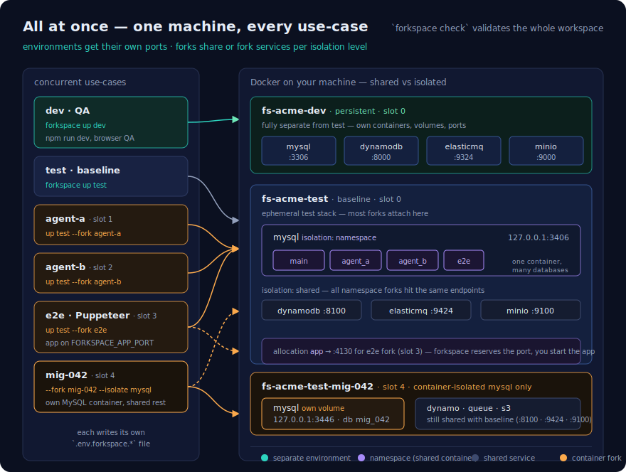
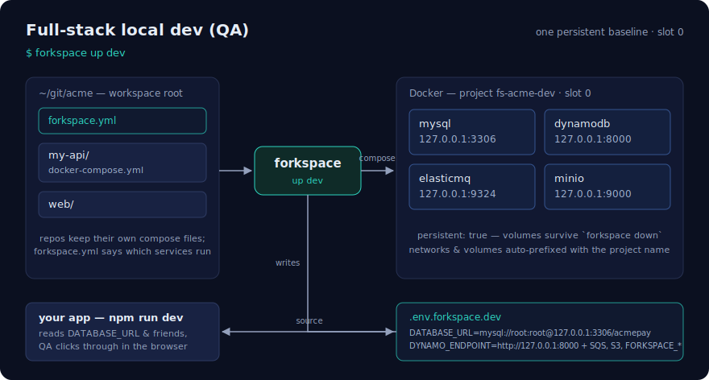
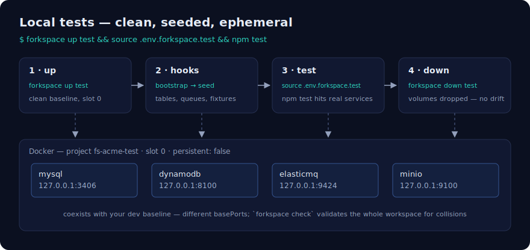
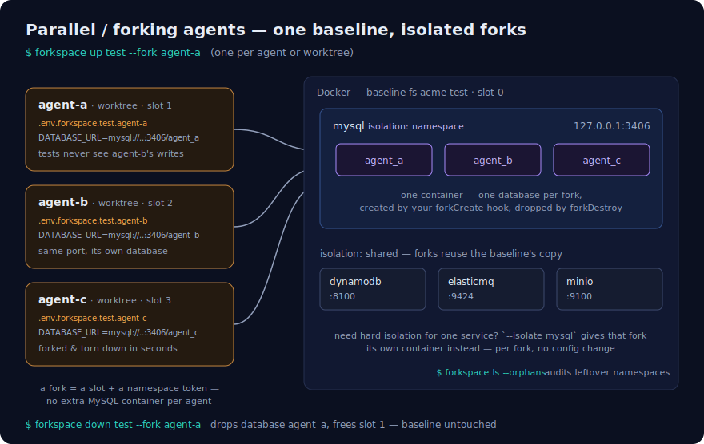
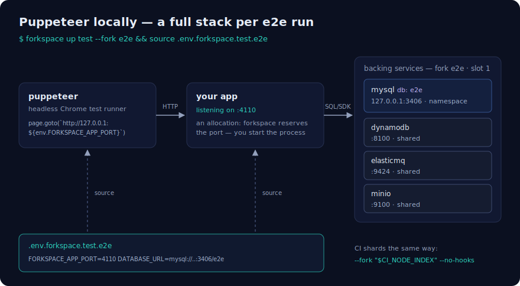
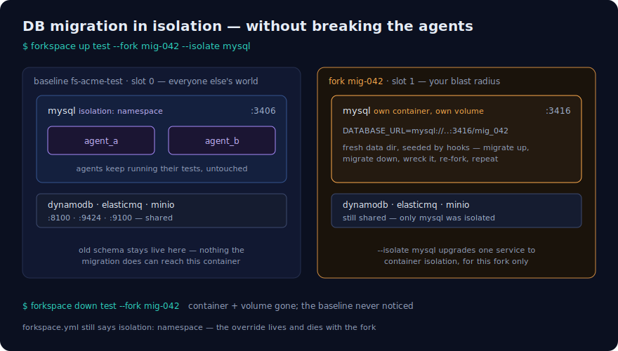

# forkspace

`forkspace` is a standalone CLI for managing isolated local dev/test environments
for multi-repo, multi-service stacks.

Run your stack. Fork it per agent or branch. Tear forks down without ceremony.

```bash
forkspace up dev                    # persistent working environment
forkspace up test                   # clean baseline test stack
forkspace up test --fork agent-a    # agent-a's own isolated copy
forkspace up test --fork agent-b    # agent-b's, on its own ports
forkspace down test --fork agent-a  # gone, volumes dropped
```

## Why

Git worktrees give agents and branches isolated *file trees*, but they all share
one machine: one port 3306, one MySQL data directory, one Docker network
namespace. Two agents running tests against "the" local database corrupt each
other's feedback loops. Full per-workspace VMs or sandboxed Docker daemons solve
this with a sledgehammer; most stacks just need their compose services forked.

`forkspace` is the lightweight middle: a workspace-level compose manager that
lets you **choose your isolation level per service** — container, namespace, or
shared — instead of duplicating everything or sharing everything.

## Scenarios

### All at once

Dev, tests, agent forks, Puppeteer e2e, and a one-off migration can all run
concurrently on one machine. Each **environment** gets its own port range; within
an environment, forks **share** or **fork** individual services depending on their
isolation level — one MySQL container can host many namespace databases while
DynamoDB stays shared, and `--isolate mysql` spins up a separate container only
for the fork that needs it.



### Full-stack local dev (QA)

One persistent baseline for day-to-day work. `forkspace up dev` starts the
services your `forkspace.yml` claims from your repos' compose files, writes
`.env.forkspace.dev`, and your app and QA sessions run against it. Volumes
survive `down`.



### Local tests

A clean, seeded, ephemeral stack on its own ports. `up` runs `bootstrap → seed`,
tests source the env file, and `down` drops the volumes so no state drifts
between runs. The test baseline coexists with your dev baseline —
`forkspace check` proves the port math workspace-wide.



### Parallel / forking agents

Worktrees isolate agents' *files*; forkspace isolates their *state*. Each agent
runs `up test --fork <name>` and gets its own slot, env file, and MySQL
database inside the one baseline container — no per-agent MySQL, no corrupted
feedback loops. `ls --orphans` audits leftover namespaces.



### Puppeteer locally

Browser e2e runs need an app server *and* backing services, all isolated from
whatever else is running. Declare the app port as an **allocation**: forkspace
reserves a per-fork port and exports `FORKSPACE_APP_PORT`; you start the app
on it and point Puppeteer at it. CI shards the same way with
`--fork "$CI_NODE_INDEX"`.



### DB migrations in isolation

Migration work is destructive by design — don't run it in a database container
other agents share. `--isolate mysql` upgrades that one service to `container`
isolation for that fork only: a fresh MySQL with its own volume to migrate,
break, and re-fork, while every agent namespace on the baseline keeps working.



## Choose your isolation level

Each service in an environment declares an `isolation` level:

| Level | What the fork gets | When to use |
|---|---|---|
| `container` | Its own compose service instance (own container, volumes, host port) | Full data isolation — separate MySQL instance per fork |
| `namespace` | A namespace token inside the baseline's service (own database, table prefix, etc.) | Schema/data isolation without extra containers |
| `shared` | The baseline service as-is | DynamoDB, queues, object storage that don't need per-fork copies |

Typical test setup: MySQL is `namespace`, everything else is `shared`. One
baseline MySQL container; each `--fork` gets its own database name derived from
the fork name.

```yaml
services:
  mysql:
    isolation: namespace
    exports:
      DATABASE_URL: "mysql://root:root@{host}:{port}/{ns}"
  dynamodb:
    isolation: shared
    exports:
      DYNAMO_ENDPOINT: "http://{host}:{port}"
```

### Tenancy framing

forkspace is the **naming authority**, not a database driver. It mints the
namespace token, exposes it in export templates (`{ns}`, `{_ns}`) and as
`FORKSPACE_NS` in the env file, and calls lifecycle hooks. All engine-specific
create/drop/list logic lives in your repo scripts.

**Boundary rule:** forkspace owns names, addresses, and lifecycle; your repos
own processes and engine-specific SQL/SDK calls.

Namespace tokens are derived from the fork name: lowercase `[a-z0-9_]+`, dashes
→ underscores, prefixed with `f_` if they would start with a digit, max 32
characters. A dashed variant (`{nsdash}`, `FORKSPACE_NS_DASH`) is also minted
for engines that forbid underscores (S3 buckets, DNS labels). Set
`baselineNs` on an environment (e.g. `main`) so the baseline's `{ns}` templates
and `FORKSPACE_NS` render correctly instead of empty.

## Install

```bash
npm install
npm run build
npm link        # or: node dist/cli.js
```

## Setup

At your workspace root (the directory containing your repos):

```bash
forkspace init      # writes a starter forkspace.yml
forkspace check     # validates compose files, services, and port math
```

See `forkspace.example.yml` for a full multi-repo example with per-service
isolation levels, allocations, and lifecycle hooks.

## Commands

| Command | What it does |
|---|---|
| `up <env> [--fork <name>] [--isolate <svcs>] [--no-hooks]` | Start an instance. Baseline runs `bootstrap → seed`; forks run `forkCreate → seed`. `--isolate mysql` forces listed services to `container` isolation for this fork. |
| `down <env> [--fork <name>] [--keep-volumes] [--force]` | Stop an instance. Forks run `forkDestroy` first. Drops volumes unless the environment is `persistent`. Refuses to drop a baseline with live forks. `--force` skips `forkDestroy` and cleans up state anyway. |
| `ls [--ps] [--orphans]` | List instances, slots, namespace tokens, and ports. `--ps` queries docker for container status. `--orphans` diffs recorded fork namespaces against `hooks.listNamespaces` output. |
| `env <env> [--fork <name>]` | Print the instance's env file (pipe into `source`). |
| `check` | Workspace-wide validation: compose files exist, services exist, no basePort collisions across environments, no slot-range overlaps. Warns on reserved `FORKSPACE_` export keys and namespace services missing `{ns}` templates. |
| `init` | Write a starter `forkspace.yml`. |

## Lifecycle hooks

Hooks are shell commands run with the instance env file loaded:

| Hook | When | Purpose |
|---|---|---|
| `bootstrap` | Baseline `up` | Create tables, queues, buckets in the baseline |
| `seed` | Every `up` | Load test data |
| `forkCreate` | Fork `up` | Engine-specific namespace/database creation |
| `forkDestroy` | Fork `down` (before teardown) | Engine-specific namespace cleanup |
| `listNamespaces` | `ls --orphans` | Print one namespace token per line to stdout |

forkspace cannot query databases itself — `listNamespaces` is the convention
for orphan detection. With the hook configured, `ls --orphans` reports:

- **orphans** — namespaces that exist in the engine but not in forkspace state
- **ghosts** — namespaces recorded in state but missing from the engine

When the hook is absent or the baseline is not up, orphan detection degrades
gracefully with a skip message.

`listNamespaces` returns one list per environment — configure it to report the
engine that is the source of truth for namespace identity (typically MySQL).
A namespace may materialize across several engines (database, key prefix,
bucket); if partial creation is a concern, aggregate in the hook (e.g. union
of all engines) rather than relying on a single engine's view.

Hooks are only as reliable as your compose healthchecks: `up --wait` trusts
them, so a healthcheck that passes before the service is actually ready
(e.g. `mysqladmin ping` over the socket before TCP accepts connections) can
cause hook failures. Prefer protocol-specific checks
(`mysqladmin ping -h 127.0.0.1 --protocol=tcp`).

## Env file contract

Every instance writes `.env.forkspace.<env>[.<fork>]` with:

- `FORKSPACE_ENV`, `FORKSPACE_FORK`, `FORKSPACE_NS`, `FORKSPACE_NS_DASH` (forks),
  `FORKSPACE_INVOKE_DIR` (directory where the CLI was invoked),
  `FORKSPACE_<SERVICE>_PORT`, `FORKSPACE_<SERVICE>_HOST`
- `FORKSPACE_BASELINE_NS`, `FORKSPACE_BASELINE_<SERVICE>_HOST/_PORT` (forks only;
  baseline addresses from state — use in `forkCreate` for clone-from-baseline)
- `FORKSPACE_<ALLOCATION>_PORT` for named port allocations (reserved slots
  forkspace exports but does not start processes for)
- Your templated exports (`DATABASE_URL`, etc.) with `{host}`, `{port}`, `{ns}`,
  `{_ns}`, `{ns_}`, `{nsdash}`, `{_nsdash}`, `{nsdash_}` substituted

Apps, tests, CI, and agents all consume the same contract.

### Binding a fork to a checkout

Hooks run with `cwd = workspace root` against the primary checkout. To bind a
fork to the checkout you invoked from:

1. Run `up` from inside the worktree (`cd worktree && forkspace up test --fork review-x`).
   Hooks can resolve paths via `$FORKSPACE_INVOKE_DIR` (e.g.
   `$FORKSPACE_INVOKE_DIR/migrations`).
2. CI-style: `up --no-hooks`, then run migrate/seed yourself from the correct
   checkout with the fork's env file sourced.

## How ports and slots work

Each instance is a docker compose project named `fs-<workspace>-<env>[-<fork>]`.

- **Networks and volumes**: compose prefixes both with the project name, so
  container-isolated forks get fresh data directories with zero configuration.
- **Ports**: forkspace generates a per-instance override file using compose's
  `!override` tag (compose ≥ 2.24) that remaps only host ports:

  ```yaml
  services:
    db:
      ports: !override
        - "3416:3306"
  ```

- **Slots**: the baseline is slot 0; forks take the lowest free slot ≥ 1,
  probed against both recorded state (`.forkspace/state.json`) and actual
  host port availability. Port math: `basePort + slot × slotSize`.

`forkspace check` validates port claims **workspace-wide** — baselines of
different environments coexist on one machine, so collisions are checked across
all environments, not just within one.

## CI

CI doesn't need the daemon-side niceties — it consumes the same contract:
run `forkspace up test --fork "$CI_NODE_INDEX" --no-hooks`, source the env
file, run tests, `forkspace down`. `forkspace.yml` stays the single source of
truth for what "test environment" means everywhere.

## What forkspace is not

- Not a sandbox. Forks isolate *state* (data, ports, networks), not code
  execution. Pair with worktrees for file isolation or a sandboxing tool for
  untrusted agents.
- Not a compose replacement. Your repos keep their compose files; forkspace
  orchestrates them.
- Not a database driver. forkspace mints namespace tokens and calls hooks;
  your scripts own `CREATE DATABASE`, DynamoDB table prefixes, S3 bucket
  naming, and anything engine-specific.

## Positioning

Standalone developer-infrastructure tool, same family as Hookrelay and Envgate —
not part of `@b2bkit`.
